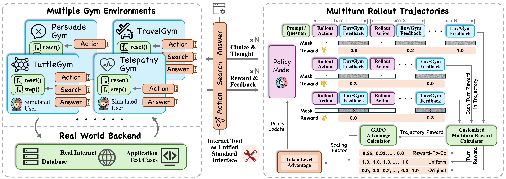

<p align="center">
  
</p>

# UserRL: UserRL: Training Proactive User-Centric Agent via Reinforcement Learning
| [**📖 Paper**](https://arxiv.org/pdf/XXX) | [**📊 Dataset**](https://github.com/SalesforceAIResearch/UserRL/tree/main/data) |

This is the official repository for paper "UserRL: UserRL: Training Proactive User-Centric Agent via Reinforcement Learning".

We provide a comprehensive framework for training LLM using reinforcement learning across diverse multi-turn user-centric gym environments. UserRL implements Group Relative Policy Optimization (GRPO) with multi-turn credit assignment for effective learning in interactive scenarios.



## 🎯 Overview

UserRL enables training language models to interact effectively with users across multiple domains through:

- **Multi-Turn Conversations**: Support for complex, extended dialogues with proper credit assignment
- **Diverse Gym Environments**: 10+ specialized environments covering reasoning, tool usage, persuasion, and more
- **Advanced RL Algorithms**: GRPO with turn-level reward attribution and trajectory scoring
- **Scalable Training**: Multi-GPU support with SGLang backend for efficient inference
- **Comprehensive Evaluation**: End-to-end pipeline for model assessment across all environments

## 🏗️ Architecture

### Core Components

```
UserRL/
├── gyms/              # Gymnasium environments for different domains
├── verl/              # Core RL training framework
├── examples/          # Training configurations and data preprocessing
├── sft/               # Supervised fine-tuning pipeline
├── eval/              # Comprehensive evaluation framework
└── data/              # Training and validation datasets
```

### Key Features

- **🤖 Multi-Environment Training**: Train on 10+ diverse environments simultaneously
- **🎯 Turn-Level Credit Assignment**: Advanced reward attribution for multi-turn scenarios  
- **⚡ Efficient Inference**: SGLang backend with optimized memory utilization
- **📊 Comprehensive Logging**: WandB integration with detailed metrics tracking
- **🔧 Flexible Configuration**: Hydra-based configuration system for easy experimentation

## 🚀 Quick Start

### Prerequisites

- Python 3.12
- CUDA-compatible GPU(s)
- OpenAI API key (for user simulation)

### Installation

1. **Create Environment**
   ```bash
   conda create -n userrl python=3.12
   conda activate userrl
   ```

2. **Install UserRL**
   ```bash
   pip install -e .[sglang]
   pip install flash-attn --no-build-isolation
   ```

3. **Install Gym Environments**
   ```bash
   bash install_gyms.sh
   ```

### Basic Training

1. **Configure Environment Variables**
   ```bash
   export CUDA_VISIBLE_DEVICES=0,1,2,3,4,5,6,7
   export OPENAI_API_KEY="your-openai-key"
   export OPENAI_BASE_URL="https://api.openai.com/v1"
   export MULTITURN_MODEL_NAME="gpt-4o"
   ```

2. **Update Training Script**
   
   Edit `examples/sglang_multiturn/train.sh` and update:
   ```bash
   PROJECT_DIR="/path/to/your/UserRL"  # Set your project path
   actor_rollout_ref.model.path=/path/to/your/model  # Set your model path
   trainer.n_gpus_per_node=8  # Adjust based on available GPUs
   ```

3. **Start Training**
   ```bash
   bash ./examples/sglang_multiturn/train.sh
   ```

## 🎮 Available Environments

UserRL includes 10+ specialized gym environments:

| Environment | Domain | Description |
|-------------|--------|-------------|
| **FunctionGym** | Mathematics | Function discovery and parameter learning |
| **IntentionGym** | Intent Recognition | User intention inference through conversation |
| **PersuadeGym** | Persuasion | Strategic persuasive communication |
| **SearchGym** | Information Retrieval | Web search and information synthesis |
| **TauGym** | Tool Usage | Multi-agent tool interaction scenarios |
| **TelepathyGym** | Mind Reading | Entity guessing through strategic questions |
| **TravelGym** | Travel Planning | Preference elicitation and recommendation |
| **TurtleGym** | Lateral Thinking | Turtle Soup puzzle solving |

Each environment provides:
- Standardized action formats (`[action]`, `[answer]`, `[finish]`)
- Multi-turn conversation support
- Domain-specific reward mechanisms
- LLM-based evaluation systems

## 🏋️ Training Pipeline

### 1. Supervised Fine-Tuning (Optional)

For improved initialization, start with SFT:

```bash
# See detailed instructions in sft/README.md
cd sft/
# Follow SFT pipeline setup and training
```

### 2. Reinforcement Learning Training

**Key Training Parameters:**

- **Algorithm**: GRPO with multi-turn credit assignment
- **Turn-Level Method**: `Equalized`, `R2G`, or `EM`
- **Trajectory Scoring**: `Sum` or `R2G`

**Training Configuration Example:**

```yaml
# Key hyperparameters in train.sh
algorithm.adv_estimator: grpo_multiturn
algorithm.gamma: 0.8
data.train_batch_size: 128
actor_rollout_ref.rollout.multi_turn.turn_level_method: "Equalized"
actor_rollout_ref.rollout.multi_turn.trajectory_score_method: "Sum"
```

### 3. Model Evaluation

Comprehensive evaluation across all environments:

```bash
# See detailed instructions in eval/README.md
cd eval/
# Follow evaluation pipeline
```

## 📊 Advanced Configuration

### Multi-GPU Training

UserRL supports distributed training across multiple GPUs:

```bash
# Configure GPU usage
export CUDA_VISIBLE_DEVICES=0,1,2,3,4,5,6,7
trainer.n_gpus_per_node=8
trainer.nnodes=1
```

### User Simulation Options

**Option 1: OpenAI GPT-4o**
```bash
export OPENAI_BASE_URL="https://api.openai.com/v1"
export MULTITURN_MODEL_NAME="gpt-4o"
```

**Option 2: Local Model**
```bash
# We apply Qwen3-32B as simulated user in paper's experiments
export OPENAI_BASE_URL="http://localhost:8000/v1"
export MULTITURN_MODEL_NAME="Qwen/Qwen3-32B"
```

### Memory Optimization

For large models, configure memory settings:

```yaml
actor_rollout_ref.model.enable_gradient_checkpointing: True
actor_rollout_ref.model.enable_activation_offload: True
actor_rollout_ref.rollout.gpu_memory_utilization: 0.50
```

## 🔧 Adding New Environments

1. **Design New Gym**: Follow patterns in `gyms/README.md`

2. **Create Data Preprocessing**: 
   ```bash
   # Create new file in examples/data_preprocess/
   # Ensure data source field starts with "interact_"
   ```

3. **Update Dataset Configuration**:
   ```bash
   python examples/data_preprocess/merge_customize.py
   ```

4. **Register Environment**:
   ```python
   # Add to verl/tools/env_manager.py
   # Use same env_name as in data preprocessing
   ```

5. **Begin Training**: Run customized training with new environment

## 📈 Monitoring and Logging

UserRL provides comprehensive logging through:

- **Console Output**: Real-time training progress
- **Weights & Biases**: Detailed metrics and visualization
- **Checkpointing**: Automatic model saving and best model selection

```yaml
trainer.logger: ['console', 'wandb']
trainer.project_name: 'UserRL'
trainer.save_freq: 1
trainer.test_freq: 5
```

## 🤝 Contributing

We welcome contributions! Please see individual component READMEs:

- [Gym Environments](gyms/README.md)
- [SFT Pipeline](sft/README.md)  
- [Evaluation Framework](eval/README.md)

## 📝 Citation

```bibtex
TBD
```

## 🙏 Acknowledgments

Built on top of:
- [VERL](https://github.com/volcengine/verl) - Volcano Engine Reinforcement Learning framework
- [SGLang](https://github.com/sgl-project/sglang) - Efficient LLM serving

---

For detailed documentation on specific components, please refer to the respective README files in each subdirectory.
